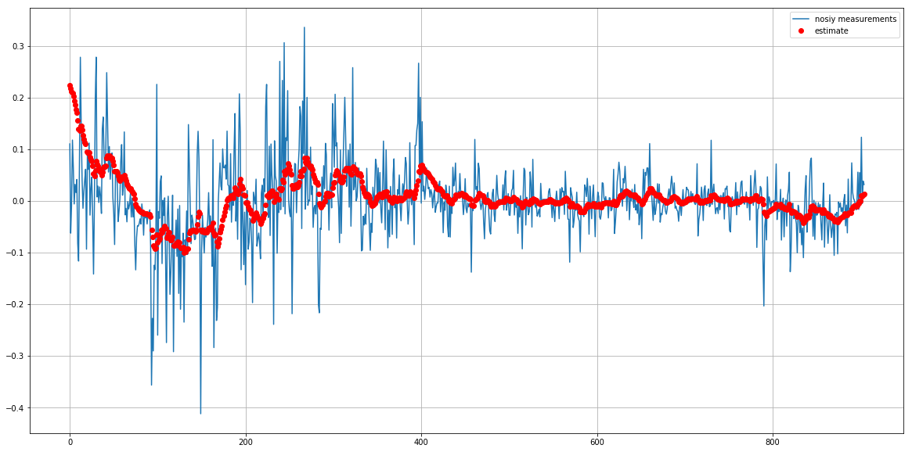

# Kalman Filter Implementation
---
## In this implementation the following steps are followed:

* 1- Using EM algorithm with 100 measurements to determine a good initial state with the other parameters required for KF implementation such as (translation matrix, measurement matrix, process noise covariance matrix and measurement noise covariance matrix).
* 2- A recurssion filter update is executed as follows:
    * a- make a predicition and save it in .csv file 
    * b- make an online update and save it in .csv file
* 3- For future measuremnts, a function called (kf_update_one_step) is used. In this function the last value in .csv file is used to make a prediction and the the update step with the new measurement is executed.


```python
# import some modules to be used.
import pickle
import pandas as pd
import numpy as np
from pykalman import KalmanFilter
import csv
import matplotlib.pyplot as plt
%matplotlib inline

```


```python
# Importing the measurements as one batch from Data.csv file
df_todo = pd.read_csv('Data.csv')
dfVarMcAyer = df_todo['VarMcAyer']
```


```python
# Initialize Kalman Filter class 
kf = KalmanFilter(transition_matrices = [1],
                  observation_matrices = [1],
                  initial_state_mean = dfVarMcAyer.values[0],
                  initial_state_covariance = 1,
                  observation_covariance=1,
                  transition_covariance=.01)
```

## 1- Using EM algorithm with 100 measurements to get good initial state and to make a good estimation to other parameters.


```python
x_initials=kf.em(dfVarMcAyer.head(100).values)

# save the internal model values
with open('kf_dfVarMcAyer.pkl','wb') as output:
    pickle.dump(kf,output, pickle.HIGHEST_PROTOCOL)
```

## 2- A recurssion filter update is implemented


```python
# Some lists to save our values
x_prediction=[] # for state prediction
p_prediction=[] # for the covariance of the state prediction
x_update=[]     # for state update
p_update=[]     # for updated state covaraince 
```


```python
# getting the initial state and covariance calculated by EM algorithm
m=x_initials.initial_state_mean
p=x_initials.initial_state_covariance
xx_=m
pp_=p

# open a .csv file to save the predictions and the updates
with open('VarMcAyer_prediction_update.csv','w') as file:
    # Setting some headings for clarity
    file.write("Prediction")
    file.write(',')
    file.write("Update")
    file.write('\n')
    
# iterate over all the measurements from 100 to the last one


    
   
        
for i in range (100,len(dfVarMcAyer.values)):
    # make a prediction step and save it 
    xx_,pp_=kf.filter_update(m,p)
    x_prediction.append(xx_[0])
    p_prediction.append(pp_[0][0])
    #file.write(np.str(xx_.astype(np.float)))
    #file.write(',')

    # make un update and save it
    m,p=kf.filter_update(m,p,dfVarMcAyer.values[i])
    x_update.append(m[0])
    p_update.append(p[0][0])
    #file.write(np.str(m.astype(np.float)))
    #file.write('\n')

with open('VarMcAyer_prediction_update.csv','w',newline='') as file:
    #file.write("Prediction")
    #file.write(',')
    #file.write("Update")
    #file.write('\n')
    csv.writer(file,delimiter=',').writerows(zip(x_prediction,x_update,p_prediction,p_update))

        
        #write.writerow([xx_,x_update])
        #write.dialect(xx_)
        #write.dialect(x_update)
        
        #file.write(x_prediction)
        #file.write(',')
        #file.write(x_update)
    
# Converting lists to arrays to be used later
x_prediction=np.array(x_prediction)
p_prediction=np.array(p_prediction)

x_update=np.array(x_update)
p_update=np.array(p_update)
        
        
        
```


```python
# some illustrations
plt.figure(figsize=(20,10))
plt.plot(dfVarMcAyer.values[100:1006],label='nosiy measurements')
plt.plot(x_update,'or',label='estimate')
plt.grid()
plt.legend()
```


    <matplotlib.legend.Legend at 0x7f226ff08128>





## 3- For future measuremnts, a function called (kf_update_one_step) is used. In this function the last value in .csv file is used to make a prediction and the the update step with the new measurement is executed.


```python
# we will define a function that take three arguments arguments, a kalman filter object pickle file, a new measurement and the data file of predictions and updates

def kf_update_one_step(kf_file,data_file,y):
    import pandas as pd
    import numpy as np
    from pykalman import KalmanFilter
    import csv
    import pickle
    with open(kf_file,'rb') as input:
        kf=pickle.load(input)
    
    with open(data_file,'r') as file:
        estimates=list(csv.reader(file))
        prior_estimate=np.array(estimates).astype(np.float)[-1][1]
        prior_cov=np.array(estimates).astype(np.float)[-1][3]
        
    x_,p_=kf.filter_update(prior_estimate,prior_cov)
    m,p=kf.filter_update(prior_estimate,prior_cov,y)
    
    x_=x_[0]
    p_=p_[0][0]
    m=m[0]
    p=p[0][0]
    
    with open(data_file,'a') as file:
        csv.writer(file,delimiter=',').writerows(zip(x_,m,[p_],[p]))
    
    return x_,m,p_,p
                                                 
    
    
        
        
        
        
    
    
    
    
```


```python
test,r,t,y=kf_update_one_step('kf_dfVarMcAyer.pkl','VarMcAyer_prediction_update.csv',3)
```
